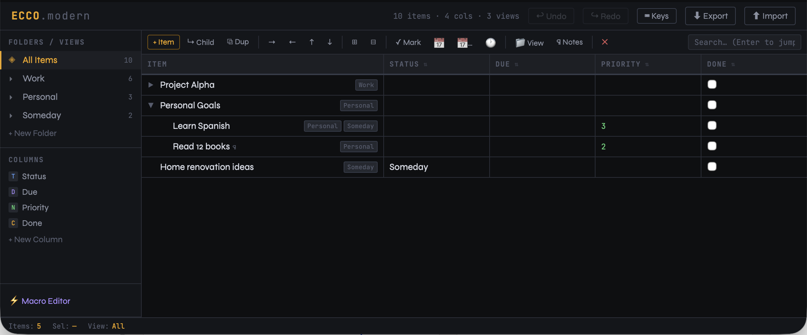

# Ecco.modern

A modern single-file reimplementation of [Ecco Pro](https://en.wikipedia.org/wiki/Ecco_Pro), the legendary 1990s personal information manager by Arabesque Software. Built as a single self-contained HTML file — no dependencies, no server, no install.



## What is Ecco Pro?

Ecco Pro (1993–1997) was a cult-classic PIM beloved by power users for its unique combination of a freeform outliner with a typed-column database layer. Nothing quite like it has existed since. This project brings its core ideas into the browser.

## Features

### Core
- **Infinite outline** — nested items with expand/collapse, drag-and-drop reordering
- **Typed columns** — attach Text, Number, Date, or Checkbox columns to any item; click any cell to edit
- **Folders / Views** — named views that items can belong to simultaneously (multi-membership)
- **Item Notes** — freeform scratchpad per item, auto-saved, searchable

### Keyboard-driven
- Full keyboard navigation — arrows, Tab/Shift+Tab to indent, Enter to add, F2 to rename
- **Ctrl+;** — stamp today's date into the first date column
- **Ctrl+Shift+;** — pick any date
- **Ctrl+T** — insert timestamp into item text
- **Ctrl+M** — toggle done (first checkbox column)
- **Ctrl+D** — duplicate item (deep copies children)
- **Ctrl+F** — Quick Assign panel: toggle folder membership by number key (1–9)
- **Ctrl+N** — toggle Notes panel
- **Alt+↑ / Alt+↓** — move item up/down
- **Ctrl+Z / Ctrl+Y** — undo/redo (60 levels)
- **Ctrl+Shift+F** — focus search; **Enter** to jump to results; **Esc** to clear
- **Ctrl+L** — return focus to outline from anywhere

### Power features
- **Undo/Redo** — 60-level history, every action snapshotted
- **Macro editor** — write JavaScript macros against the outline data with a live API
- **Sort** — click any column header to sort ascending/descending
- **Search** — live full-text search across item text, notes, and all column values
- **Export/Import** — save and load your data as JSON
- **localStorage** — auto-saves on every change

## Usage

Download `ecco.html` and open it in any modern browser. That's it.

```bash
# Or serve locally
npx serve .
```

Your data is saved automatically to `localStorage`. Use the **⬇ Export** button to save a `.json` backup to disk, and **⬆ Import** to restore it.

## Keyboard Shortcut Reference

| Key | Action |
|-----|--------|
| `↑` / `↓` | Move selection |
| `→` / `←` | Expand / Collapse (or Indent / Unindent) |
| `Enter` | Add item below |
| `Ctrl+Enter` | Add child item |
| `Tab` / `Shift+Tab` | Indent / Unindent |
| `Alt+↑` / `Alt+↓` | Move item up / down |
| `F2` or double-click | Rename item |
| `Ctrl+D` | Duplicate |
| `Delete` | Delete item |
| `Ctrl+Z` / `Ctrl+Y` | Undo / Redo |
| `Ctrl+;` | Stamp today's date |
| `Ctrl+Shift+;` | Pick a date |
| `Ctrl+T` | Insert timestamp |
| `Ctrl+M` | Toggle done |
| `Ctrl+F` | Quick assign to folder/view |
| `Ctrl+N` | Toggle notes panel |
| `Ctrl+*` | Expand all |
| `Ctrl+/` | Collapse all |
| `Ctrl+Home` / `Ctrl+End` | Jump to first / last |
| `PgUp` / `PgDn` | Jump 10 rows |
| `Ctrl+Shift+F` | Focus search |
| `Ctrl+L` | Focus outline |
| `Ctrl+S` | Export to file |
| `Esc` | Clear search / return to All Items |

## Macro API

Open the **⚡ Macro Editor** from the sidebar. Macros are plain JavaScript with access to:

```javascript
allItems()                    // → all items in the outline
visibleItems()                // → currently visible/filtered items
getCell(itemId, colId)        // → get a column value
setCell(itemId, colId, value) // → set a column value
addItem(text, parentId)       // → create a new item
deleteItem(id)                // → delete an item
log(msg)                      // → print to output console
state                         // → raw state object
```

Example — mark all visible items done:
```javascript
visibleItems().forEach(item => setCell(item.id, 4, true));
log('Done: ' + visibleItems().length + ' items');
```

## Data Format

Data is stored as JSON, making it easy to manipulate externally:

```json
{
  "items": [
    {
      "id": 1,
      "text": "Project Alpha",
      "parentId": null,
      "folders": [1],
      "cols": { "2": "2026-03-01", "3": 2, "4": false },
      "note": "Initial notes here"
    }
  ],
  "columns": [{ "id": 2, "name": "Due", "type": "date" }],
  "folders": [{ "id": 1, "name": "Work" }],
  "macros": []
}
```

## Inspiration

Ecco Pro was developed by Arabesque Software and later acquired by NetManage. It was discontinued in the late 1990s but maintained a devoted user base for decades. This project is a spiritual successor, not a clone — it reimagines the core outliner+columns concept for modern browsers.

## License

MIT
